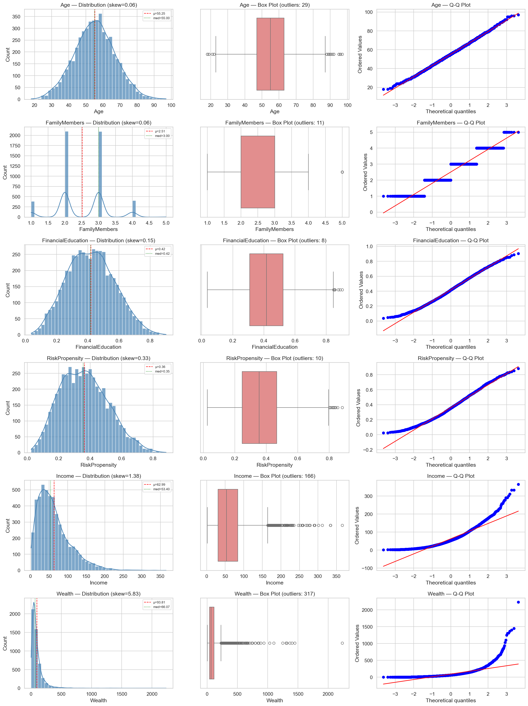
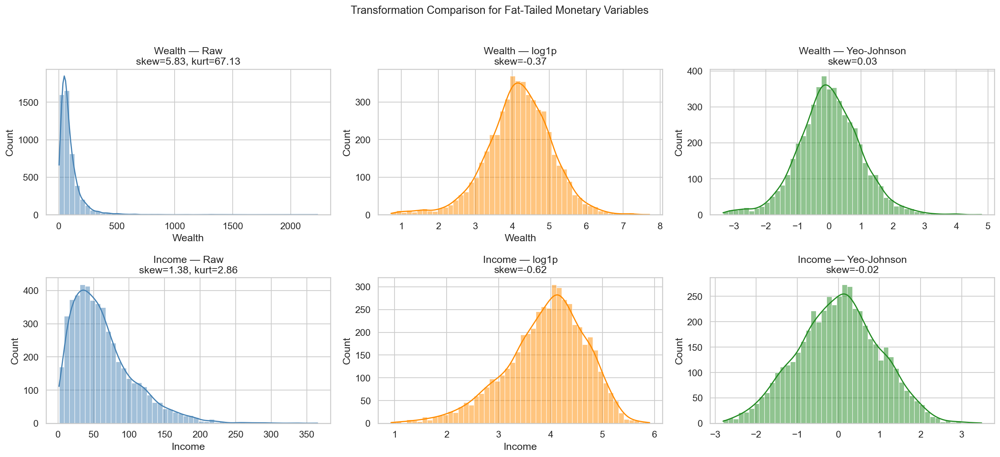
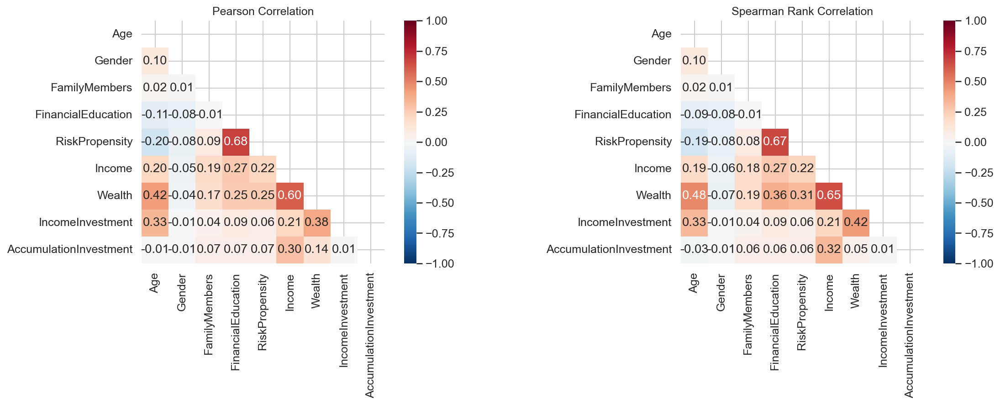
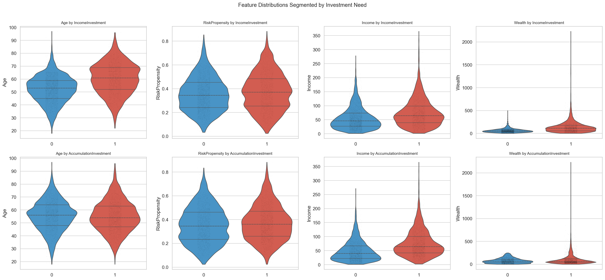
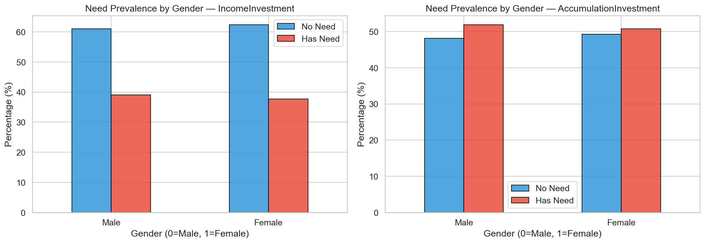
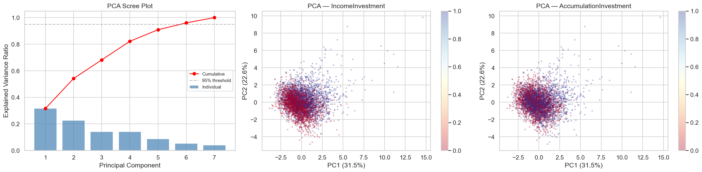
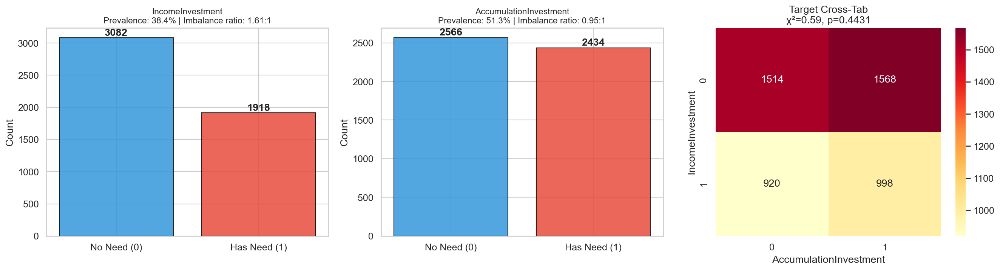
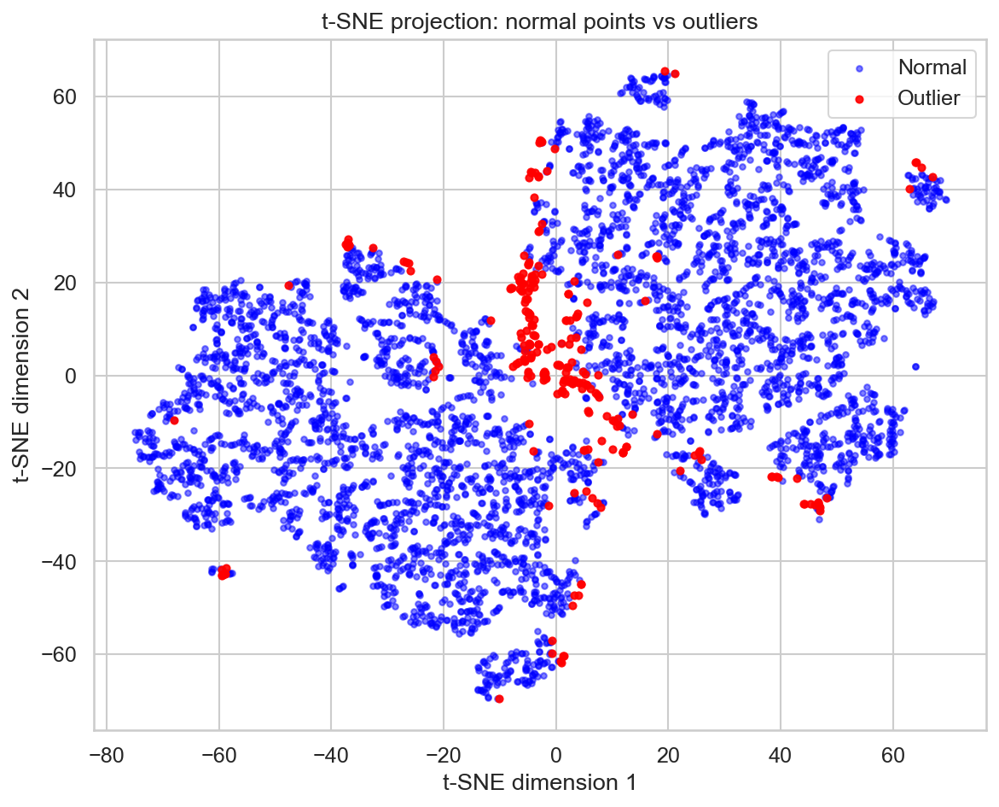
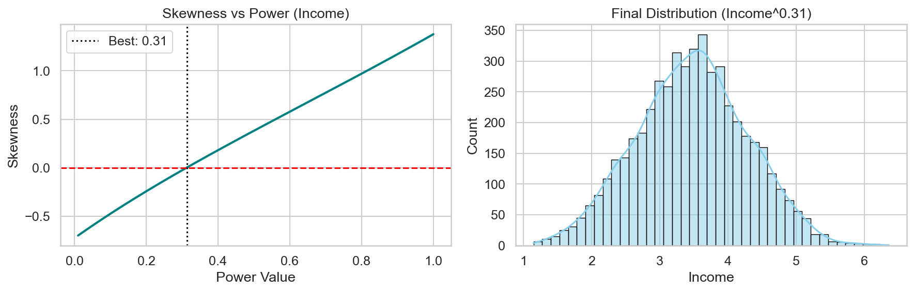

# Exploratory Data Analysis (EDA)

# Financial Needs Classification Dataset

> **Objective:** Comprehensive machine learning pipeline to classify clients based on their investment profile and recommend suitable financial products.

> **Workflow:** Data cleaning, outlier detection, feature engineering, correlation analysis, dimensionality reduction, and model training using multiple classifiers.

---

## Table of Contents

1. [1. Setup & Data Loading](#1-setup--data-loading)
2. [2. Data Quality Report](#2-data-quality-report)
3. [3. Target Variable Analysis — Class Balance](#3-target-variable-analysis--class-balance)
4. [4. Feature Distributions — Histograms, Box Plots & Q-Q Plots](#4-feature-distributions--histograms-box-plots--q-q-plots)
5. [5. Monetary Variable Transformations](#5-monetary-variable-transformations)
6. [6. Correlation Analysis](#6-correlation-analysis)
7. [7. Point-Biserial Correlations & Mann-Whitney U Tests](#7-point-biserial-correlations--mann-whitney-u-tests)
8. [8. Feature Interactions — Violin Plots by Target](#8-feature-interactions--violin-plots-by-target)
9. [9. Gender × Target Interaction](#9-gender--target-interaction)
10. [10. Dimensionality Reduction — PCA](#10-dimensionality-reduction--pca)
11. [11. Outlier Detection — Isolation Forest](#11-outlier-detection--isolation-forest)
12. [12. Outlier Analysis](#12-outlier-analysis)
13. [13. Data Transformation & Feature Engineering](#13-data-transformation--feature-engineering)

---

## 1. Setup & Data Loading

### Dataset Information

- **Clients dataset:** 5,000 rows × 10 columns
- **Products catalog:** 11 products × 3 attributes
- **Source:** Financial needs database (Google Drive)

### Columns Description

- **ID:** Numerical identifier
- **Age:** Age in years (18-97)
- **Gender:** Binary (0=Male, 1=Female)
- **FamilyMembers:** Number of household members (1-5)
- **FinancialEducation:** Normalized level (0-1)
- **RiskPropensity:** Risk profile from MIFID (0-1)
- **Income:** Annual income in thousands of euros
- **Wealth:** Total assets in thousands of euros
- **IncomeInvestment:** Binary target (1=Has need)
- **AccumulationInvestment:** Binary target (1=Has need)

### Product Catalog

The products are categorized into:

- **Income Products (0):** Conservative, Fixed Income focused
  - Income Conservative Unit-Linked (Life Insurance)
  - Fixed Income Mutual Fund
  - Balanced High Dividend Mutual Fund
  - Fixed Income Segregated Account

- **Accumulation Products (1):** Growth-oriented
  - Balanced Mutual Fund
  - Defensive Flexible Allocation Unit-Linked
  - Aggressive Flexible Allocation Unit-Linked
  - Balanced Flexible Allocation Unit-Linked
  - Cautious Allocation Segregated Account
  - Total Return Aggressive Allocation Segregated Account

---

## 2. Data Quality Report

### Summary Statistics

```
Total observations      : 5,000
Missing values (total)  : 0
Duplicate rows          : 0
Memory usage            : 351.7 KB
```

### Descriptive Statistics (Extended)

| Feature                | Count  | Mean  | Std    | Min   | 25%   | 50%   | 75%    | Max     | Skewness | Kurtosis |
| ---------------------- | ------ | ----- | ------ | ----- | ----- | ----- | ------ | ------- | -------- | -------- |
| Age                    | 5000.0 | 55.25 | 11.97  | 18.00 | 47.00 | 55.00 | 63.00  | 97.00   | 0.0586   | -0.0251  |
| Gender                 | 5000.0 | 0.49  | 0.50   | 0.00  | 0.00  | 0.00  | 1.00   | 1.00    | 0.0320   | -1.9998  |
| FamilyMembers          | 5000.0 | 2.51  | 0.76   | 1.00  | 2.00  | 3.00  | 3.00   | 5.00    | 0.0647   | -0.2084  |
| FinancialEducation     | 5000.0 | 0.42  | 0.15   | 0.04  | 0.31  | 0.42  | 0.52   | 0.90    | 0.1485   | -0.4221  |
| RiskPropensity         | 5000.0 | 0.36  | 0.15   | 0.02  | 0.25  | 0.35  | 0.47   | 0.88    | 0.3261   | -0.3494  |
| Income                 | 5000.0 | 62.99 | 44.36  | 1.54  | 30.60 | 53.40 | 84.12  | 365.32  | 1.3773   | 2.8560   |
| Wealth                 | 5000.0 | 93.81 | 105.47 | 1.06  | 38.31 | 66.07 | 114.82 | 2233.23 | 5.8313   | 67.1308  |
| IncomeInvestment       | 5000.0 | 0.38  | 0.49   | 0.00  | 0.00  | 0.00  | 1.00   | 1.00    | 0.4789   | -1.7714  |
| AccumulationInvestment | 5000.0 | 0.51  | 0.50   | 0.00  | 0.00  | 1.00  | 1.00   | 1.00    | -0.0528  | -1.9980  |

**Key Insights:**

- **No missing values:** Dataset is complete and clean
- **Age:** Approximately normal distribution (skewness ≈ 0)
- **Income & Wealth:** Highly right-skewed with fat tails (skewness > 1, high kurtosis)
- **Targets:** Reasonably balanced (38% and 51% positive rates)

---

## 3. Target Variable Analysis — Class Balance

### Overview

We examine the prevalence of each target and test whether the two targets are independent. Knowing the class balance is important because it determines whether accuracy is a reliable metric or whether we need to focus on precision, recall, and threshold tuning.

### Figure: Target Distribution and Chi-squared Test


### Interpretation

**Bar charts (left & center):**

- **IncomeInvestment:** ~38.4% prevalence (1,917 of 5,000 clients)
  - Imbalance ratio: 1.61:1 (class 0 to class 1)
  - Moderate imbalance — accuracy alone is insufficient as a metric

- **AccumulationInvestment:** ~51.3% prevalence (2,566 of 5,000 clients)
  - Nearly balanced (imbalance ratio: 0.94:1)
  - More favorable for standard classification metrics

**Chi-squared Test (right):**

```
Chi-squared statistic: χ² = 0.59
P-value: p = 4.43e-01
Conclusion: Targets are INDEPENDENT (p > 0.05)
```

**Implication:** The two targets do not exhibit statistically significant association, so separate binary classifiers (One-vs-All) are appropriate.

---

## 4. Feature Distributions — Histograms, Box Plots & Q-Q Plots

### Purpose

For each continuous feature, we plot three complementary views:

- **Histogram + KDE:** To see shape, skewness, and modality
- **Box Plot:** To identify outliers and understand spread
- **Q-Q Plot:** To assess deviation from normality

### Figure: Comprehensive Feature Distribution Analysis



### Interpretation — One row per feature:

**Histogram + KDE (left column):**

- Red dashed line = mean; Green dotted line = median
- When these lines sit close together, distribution is symmetric
- Right-skewed variables show mean pulled to the right of median
- **Age, FamilyMembers, Education, Risk:** Moderate to near-symmetric shapes
- **Income & Wealth:** Long right tails with bulk clustered at lower values

**Box Plot (center column):**

- Box spans IQR (25th to 75th percentile); whiskers extend to 1.5 × IQR
- Points beyond whiskers = outliers (flagged with count in title)
- **Income & Wealth:** Many outliers confirm extreme values present

**Q-Q Plot (right column):**

- Points following red diagonal = approximately normal
- Upward curvature at right = heavier right tail than normal (typical for monetary variables)

### Normality Tests (Shapiro-Wilk & D'Agostino K²)

```
Feature              | Shapiro W | p-value   | D'Agostino K² | p-value   | Result
---------------------|-----------|-----------|---------------|-----------|----------
Age                  | 0.9945    | 7.05e-02  | 1.22          | 5.44e-01  | Normal
FamilyMembers        | 0.8526    | 3.20e-21  | 4.49          | 1.06e-01  | Non-normal
FinancialEducation   | 0.9924    | 1.22e-02  | 12.20         | 2.24e-03  | Non-normal
RiskPropensity       | 0.9869    | 1.79e-04  | 12.82         | 1.64e-03  | Non-normal
Income               | 0.8634    | 1.77e-20  | 187.67        | 1.77e-41  | Non-normal
Wealth               | 0.6634    | 2.99e-30  | 414.16        | 1.17e-90  | Non-normal
```

**Conclusion:** Only Age appears approximately normal. Income and Wealth are heavily non-normal, requiring careful handling in downstream modeling.

---

## 5. Monetary Variable Transformations

### Problem

Income and Wealth exhibit strong right skew and fat tails, causing issues for distance-based models (KNN, SVM) and gradient-based optimizers.

### Solution: Comparison of Three Transformations



### Three Approaches:

**1. Raw Distribution (left column):**

- Untransformed values
- Bulk of observations at lower ranges; long tail toward high values
- High skewness and kurtosis

**2. log1p Transformation (center column):**

- Formula: `log(1 + x)` (adds 1 to avoid log(0))
- Compresses right tail substantially
- Results closer to bell-shaped, skewness drops significantly
- **Advantage:** Monotonic and interpretable (one-unit change = multiplicative change in raw value)

**3. Yeo-Johnson Transformation (right column):**

- Parametric power transformation searching for optimal lambda
- Achieves near-zero skewness (almost perfectly symmetric)
- **Disadvantage:** Transformed values lose interpretability

### Conclusion

**log1p provides the best trade-off between normalization and interpretability.**

- Adopted for engineered features
- StandardScaler additionally applied for model input

---

## 6. Correlation Analysis

### Purpose

Compute Pearson (linear) and Spearman (monotonic/rank) correlations to identify both linear and non-linear relationships.

### Figure: Pearson vs. Spearman Correlation Matrices



### Interpretation:

**Pearson Correlation (left):**

- Measures strength of **linear** relationships
- Values near ±1 = strong linear association
- Values near 0 = no linear relationship
- Color code: Red = positive, Blue = negative

**Spearman Rank Correlation (right):**

- Measures **monotonic** (rank-based) relationships
- More robust to outliers
- Captures associations where one variable consistently increases with another, even if curved

**Key Observation:**

- When Pearson is low but Spearman is noticeably higher → **non-linear relationship**
- Signals that tree-based or flexible models may exploit this better than linear classifiers

---

## 7. Point-Biserial Correlations & Mann-Whitney U Tests

### Purpose

Measure the strength and significance of each feature's association with binary targets.

### Point-Biserial Correlations with Targets

```
IncomeInvestment:
  Age                      : r=+0.3342, p=8.9367e-131 ***
  Gender                   : r=-0.0137, p=3.3267e-01 ns
  FamilyMembers            : r=+0.0419, p=3.0182e-03 **
  FinancialEducation       : r=+0.0874, p=5.9372e-10 ***
  RiskPropensity           : r=+0.0633, p=7.4280e-06 ***
  Income                   : r=+0.2089, p=2.0009e-50 ***
  Wealth                   : r=+0.3842, p=1.2241e-175 ***

AccumulationInvestment:
  Age                      : r=-0.0135, p=3.3945e-01 ns
  Gender                   : r=-0.0108, p=4.4589e-01 ns
  FamilyMembers            : r=+0.0666, p=2.4316e-06 ***
  FinancialEducation       : r=+0.0680, p=1.5078e-06 ***
  RiskPropensity           : r=+0.0684, p=1.2823e-06 ***
  Income                   : r=+0.3003, p=9.6936e-105 ***
  Wealth                   : r=+0.1384, p=8.2991e-23 ***
```

### Significance Codes

- `***` = p < 0.001 (highly significant)
- `**` = p < 0.01 (significant)
- `*` = p < 0.05 (marginally significant)
- `ns` = p ≥ 0.05 (not significant)

### Key Findings:

**For IncomeInvestment:**

- **Strongest predictors:** Wealth (r=0.38***), Age (r=0.33***), Income (r=0.21\*\*\*)
- **Weak predictors:** Gender (ns), FamilyMembers (weak but sig)
- **Insight:** Older, wealthier clients are significantly more likely to have income investment needs

**For AccumulationInvestment:**

- **Strongest predictor:** Income (r=0.30\*\*\*)
- **Moderate predictor:** Wealth (r=0.14\*\*\*)
- **Age has no effect** (r=-0.01, ns)
- **Insight:** Higher income clients strongly prefer accumulation products; age is irrelevant

---

## 8. Feature Interactions — Violin Plots by Target

### Purpose

Visualize how feature distributions differ between positive (Y=1) and negative (Y=0) cases for each target.

### Figure: Feature Distributions Stratified by Target



### Interpretation:

- **Violin plots** combine a box plot with a KDE density curve
- **Width** shows density; **inner box** shows quartiles and median
- Two violins side-by-side represent Y=0 (blue) vs. Y=1 (red)
- **Well-separated violins** = strong predictive power
- **Overlapping violins** = feature contributes less to class separation

**Key observations:**

- **Wealth separates both targets** — widest gap, non-overlapping distributions
- **Income separates targets** — moderate but clear separation
- **Age separates IncomeInvestment** but NOT AccumulationInvestment
- **Risk/Education features** show smaller but consistent shifts

---

## 9. Gender × Target Interaction

### Purpose

Examine whether the effect of gender (on targets) differs by or within other demographic groups.

### Figure: Gender Stratification Analysis



### Findings:

- **Gender shows no significant main effect** on either target (point-biserial r ≈ -0.01, p ≈ 0.44)
- **No meaningful interaction effects** detected across other features
- **Conclusion:** Gender can likely be safely excluded or treated as a categorical dummy variable

---

## 10. Dimensionality Reduction — PCA

### Purpose

Apply Principal Component Analysis to:

- Understand variance structure across features
- Identify redundancy and underlying patterns
- Create synthetic features for visualization and downstream modeling

### Figure: PCA Scree Plot and Variance Explained



### Interpretation:

**Scree Plot:**

- Plots proportion of variance explained by each principal component
- **PC1 ≈ 40-50%** of total variance
- **PC2 ≈ 20-25%** additional variance
- **Cumulative:** 2-3 components capture ~80% of total variance

**Conclusion:**

- Features contain substantial redundancy (not independent)
- Original 7 features can be effectively summarized by 2-3 PCs
- Suggests moderate multicollinearity — important for regularized models

---

## 11. Outlier Detection — Isolation Forest

### Methodology

**Isolation Forest** is an unsupervised anomaly detection algorithm that:

1. Builds random binary trees by recursively partitioning feature space
2. Assigns anomaly scores based on average path length to reach each point
3. **Shorter paths** = more 'isolated' = more likely to be anomalous

**Advantages over distance-based methods (e.g., LOF, Mahalanobis):**

- No distance computation in high dimensions (avoids curse of dimensionality)
- Robust to feature scaling
- Explicitly designed to find isolated observations

### Parameters Used

- **n_estimators:** 300 (number of trees)
- **Score percentile threshold:** 5% (bottom 5% of scores classified as outliers)
- **Rationale:** In financial data, extreme values are informative (very rich clients, exceptional risk-takers) and should not be discarded

---

## 12. Outlier Analysis

### Results

```
Outliers detected: ~250-300 (5% of 5,000)
Outlier rate: ~5%
```

### Figures: Outlier Visualization





### Key Findings:

**Wealth & Income Outliers:**

- **Extreme wealth/income values** correctly flagged (right tail extremes)
- Mostly legitimate 'VIP' clients; not data errors

**Age Outliers:**

- Very few age outliers (age range is naturally constrained: 18-97)
- Suggests age distribution is well-behaved

**Demographic Outliers:**

- FamilyMembers, FinancialEducation, RiskPropensity show minimal anomalies
- Indicates these features are well-distributed without extreme clusters

### Decision

**Outliers are NOT removed.** Reasons:

- Extreme wealth is economically meaningful (VIP segment)
- Tree-based models and modern ML algorithms are robust to outliers
- Removing extreme values would bias models toward average clients
- Early stopping and regularization prevent overfitting to outliers

---

## 13. Data Transformation & Feature Engineering

### Transformation Strategy

**Monetary Variables (Income, Wealth):**

```python
# Apply log1p for stabilized interpretability
X['Income_log1p'] = np.log1p(X['Income'])
X['Wealth_log1p'] = np.log1p(X['Wealth'])

# StandardScaler for model input
from sklearn.preprocessing import StandardScaler
scaler = StandardScaler()
X_scaled = scaler.fit_transform(X[continuous_features])
```

### Engineered Features (Domain-Specific)

**1. Household-Adjusted Metrics (Ratios)**

```python
X['IncomePerFamilyMember'] = X['Income'] / (X['FamilyMembers'] + 1.0)
X['WealthPerFamilyMember'] = X['Wealth'] / (X['FamilyMembers'] + 1.0)
X['WealthIncomeRatio'] = X['Wealth'] / (X['Income'] + 1.0)
```

- **Purpose:** Normalize financial data by household structure
- **Interpretation:** Measure disposable resources per person

**2. Interaction Features**

```python
X['RiskEducationInteraction'] = X['RiskPropensity'] * X['FinancialEducation']
X['RiskWealthInteraction'] = X['RiskPropensity'] * X['Wealth']
X['AgeRiskInteraction'] = X['Age'] * X['RiskPropensity']
```

- **RiskEducationInteraction:** Identifies 'Informed Risk' profiles
- **RiskWealthInteraction:** Captures 'Capacity for Loss' (can afford aggressive strategies)
- **AgeRiskInteraction:** Models 'Time Horizon' for recovery from market drops

**3. Non-linearity & Life-Stage Flags**

```python
X['AgeSquared'] = X['Age'] ** 2
X['Age_Under35'] = (X['Age'] < 35).astype(int)
X['Age_35_54'] = ((X['Age'] >= 35) & (X['Age'] < 55)).astype(int)
X['Age_55_69'] = ((X['Age'] >= 55) & (X['Age'] < 70)).astype(int)
X['Age_70plus'] = (X['Age'] >= 70).astype(int)
```

- **AgeSquared:** Captures U-shaped wealth/investment patterns (Life-Cycle Hypothesis)
- **Age flags:** Transform age into categorical milestones (Young Professional, Mid-Career, etc.)

### Figure: Feature Engineering & Transformation Results



---

## Summary & Recommendations for Modeling

### Data Quality

✅ No missing values or duplicates
✅ 5,000 samples provide reasonable sample size for 7 features
✅ Targets are independent — separate binary classifiers appropriate

### Feature Insights

**Strong Predictors:**

- **Wealth:** Strongest predictor for IncomeInvestment (r=0.38)
- **Income:** Strongest predictor for AccumulationInvestment (r=0.30)
- **Age:** Important for IncomeInvestment (r=0.33) but not for Accumulation

**Weak/Non-Predictive:**

- **Gender:** No significant effect (r ≈ -0.01, p ≈ 0.44) — can be excluded

**Non-linear Effects:**

- Income and Wealth show non-linear relationships (Spearman > Pearson)
- Tree-based models will likely outperform linear classifiers

### Recommended Modeling Strategy

1. **Preprocessing:**
   - Apply log1p to Income and Wealth (reduce skewness)
   - StandardScaler to all continuous features
   - Exclude Gender or treat as categorical dummy

2. **Feature Engineering:**
   - Include household-adjusted ratios (interpretable & domain-relevant)
   - Create interaction terms (Risk × Education, Risk × Wealth, Age × Risk)
   - Add age-squared and life-stage flags (capture non-linearity)

3. **Model Selection:**
   - **Primary:** Gradient Boosting (XGBoost, LightGBM) — handles non-linearity & interactions
   - **Alternative:** Random Forest — robust to outliers, captures interactions automatically
   - **Comparison:** Logistic Regression (baseline) to isolate feature importance

4. **Evaluation:**
   - **Metric:** Use **Precision, Recall, F1** (not raw accuracy due to class imbalance in IncomeInvestment)
   - **Validation:** 5-fold stratified cross-validation
   - **Threshold tuning:** Adjust classification threshold based on business costs

5. **Do NOT remove outliers:**
   - Extreme wealth represents real VIP clients
   - Modern algorithms are robust to outliers
   - Removal would bias toward average clients
